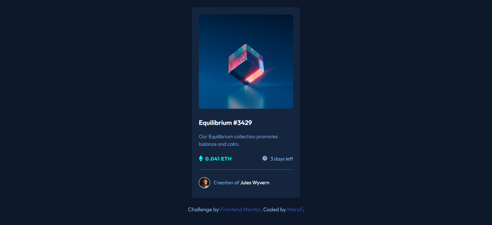

# Frontend Mentor - NFT preview card component solution

This is a solution to the [NFT preview card component challenge on Frontend Mentor](https://www.frontendmentor.io/challenges/nft-preview-card-component-SbdUL_w0U). Frontend Mentor challenges help you improve your coding skills by building realistic projects. 

## Table of contents

- [Overview](#overview)
  - [The challenge](#the-challenge)
  - [Screenshot](#screenshot)
  - [Links](#links)
- [My process](#my-process)
  - [Built with](#built-with)
  - [What I learned](#what-i-learned)
  - [Continued development](#continued-development)
  - [Useful resources](#useful-resources)
- [Author](#author)
- [Acknowledgments](#acknowledgments)


## Overview

### The challenge

Users should be able to:

- View the optimal layout depending on their device's screen size
- See hover states for interactive elements

### Screenshot



### Links

- Solution URL: (https://github.com/Janselin/nft-preview-card-component)
- Live Site URL: (https://janselin.github.io/nft-preview-card-component/)

## My process

### Built with

- Semantic HTML5 markup
- CSS custom properties
- Flexbox
- Pseudo Elements
- BEM


### What I learned

I learned a lot about pseudo elements, and pseudo classes. I've also put more practice on my BEM method.
I'm proud of the overlay effect and the use of ``::before``


```css
.card--icon::before {
    content: url(./images/icon-ethereum.svg);
    vertical-align: middle;
    margin-right: 7px;
}
```


### Useful resources

- [w3schools](https://www.w3schools.com/css/tryit.asp?filename=trycss_css_image_overlay_fade) - This helped me to work on my overlay effect 


## Author

- Website - (https://github.com/Janselin/)
- Frontend Mentor - [@janselin](https://www.frontendmentor.io/profile/Janselin)


